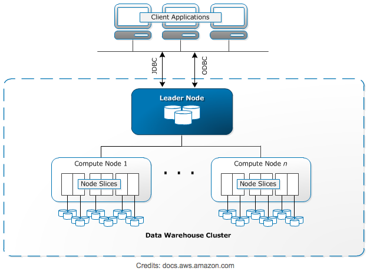

# redshift_DW
Simple project for building DW using Amazon Redshift

## Project Introduction
A music streaming startup, Sparkify, has grown their user base and song database and want to move their processes and data onto the cloud. Their data resides in S3, in a directory of JSON logs on user activity on the app, as well as a directory with JSON metadata on the songs in their app.  

## Project Goal
In this project, using knowledge of data warehouse and **Amazon Redshift**, I am going to build an ETL pipeline that extracts JSON data from S3, stages them in **Amazon Redshift**, and transform data into star schema (a set of dimensional tables and a fact table) so analytics team can use them for finding insights like what songs played by whom, when, and where. **Amazon Redshift** is a column-oriented cloud database with many advantages.

[Excerpt from HEVO Data blog](https://hevodata.com/blog/amazon-redshift-pros-and-cons/)
#### 1. Pros of Amazon Redshift

  - Great speed for loading data and querying for analytical purpose
  - High performance with massive parallelism
  - Horizontally scalable
  - Massive storage capacity
  - Attractive pricing
  - SQL interface
  - Security

#### 2. Cons of Amazon Redshift

  - Doesn't enforce uniqueness
  - Only S3, DynamoDB and Amazon EMR support for parallel upload
  - Requires a good understanding of sort and dist keys
  - Cannot be used as live app database

#### 3. Amazon Redshift Architecture



## Datasets

#### 1. Song Dataset
This data is a real data from the [Million Song Dataset](http://millionsongdataset.com/). Each file is in JSON format and contains metadata about a song and the artist of that song. The files are partitioned by the first three letters of each song's track ID. For example, here are filepaths to two files in this dataset.

```
song_data/A/B/C/TRABCEI128F424C983.json
song_data/A/A/B/TRAABJL12903CDCF1A.json
```

And below is an example of what a single song file, TRAABJL12903CDCF1A.json, looks lik

```
{"num_songs": 1, "artist_id": "ARJIE2Y1187B994AB7", "artist_latitude": null, "artist_longitude": null, "artist_location": "", "artist_name": "Line Renaud", "song_id": "SOUPIRU12A6D4FA1E1", "title": "Der Kleine Dompfaff", "duration": 152.92036, "year": 0}
```

#### 2. Log Dataset
Log files in JSON format generated by this [event simulator]https://github.com/Interana/eventsim) based on the song dataset. These simulate app activity logs from an imaginary music streamin gapp based on configuration settings.

Log files are partitioned by year and month. For example, here are filepaths to two files in this dataset.

```
log_data/2018/11/2018-11-12-events.json
log_data/2018/11/2018-11-13-events.json
```

And below is an example of what the data in a log file, 2018-11-12-events.json, looks like.


## Project Steps

#### 0. Create and run Amazon Redshift cluster

  - Make sure the Redshift cluster is given IAM role with AmazonS3ReadOnlyAccess permission so Redshift can load datasets int staging tables
  
#### 1. Design and create staging tables

  - 2 staging tables: staging_songs, staging_events
  
#### 2. Design and create star schema tables for song play analysis

  - 1 fact table: songplays
  - 4 dimension tables: users, songs, artists, time

#### 3. Load S3 data into staging tables

  - Use COPY command with proper configuration

#### 4. Transform staging data into datawarehouse tables

  - Use INSERT command with proper tranformation of staging data


## Schema for staging tables

#### 1. `staging_songs`
  - Fields: num_songs, artist_id, artist_latitude, artist_longitude, artist_location, artist_name, song_id, title, duration, year


#### 2. `staging_events`
  - Fields: artist, auth, firstName, gender, itemInSession, lastName, length, level, location, method, page, registration, sessionId, song, status, ts, userAgent, userId       


## Schema for datawarehouse tables

#### Fact table
1. `songplays` 
  - Fields: songplay_id, start_time, user_id, level, song_id, artist_id, session_id, location, user_agent
  - Join staging_songs and staging_events with matching song title and artist name. 
  - Only include records with page value is 'NextSong'
  - Dist key: songplay_id
  - Sort key: song_id

#### Dimension tables
1. `users`
  - Fields: user_id, first_name, last_name, gender, level
  - Records in staging_events
  - user_id field must be unique
  - Dist all
  - Sort key: user_id

2. `songs`
  - Fields: song_id, title, artist_id, year, duration
  - Records in staging_songs
  - song_id field must be unique
  - Dist all
  - Sort key: song_id
  
3. `artists`
  - Fields: artist_id, name, location, lattitude, longitude
  - Records in staging_songs
  - artist_id field must be unique
  - Dist all
  - Sort key: artist_id
  
4. `time`
  - Fields: start_time, hour, day, week, month, year, weekday
  - Records in staging_events
  - start_time field must be unique of which value comes from staging_events.ts field
  - Dist key: start_time
  - Sort key: start_time

## Project Files

#### 1. dwh.cfg

  - Configuration file having values for Redshift cluster, IAM role ARN, S3 file path

#### 2. sql_queries.py

  - SQL statements defined for DROP/CREATE tables, loading S3 files into staging, Transform and INSERT data into data warehouse tables

#### 3. create_tables.py

  - Python code for dropping and creating all tables
  
#### 4. etl.py

  - Python code with ETL pipeline

## Running Programs
With Redshift running and configuration is properly done

#### 1. Create tables
```python
python create_tables.py
```

#### 2. Run ETL
```python
python etl.py
```

## ETL Result Check

#### 1. Check `songs` data
```
select * from public."songs" 
limit 10;
```

#### 2. Check `songplays` data in songplay_id ascending order
```
select * from public."songplays"
order by songplay_id
limit 10;
```

#### 3. Check `songplays` data in songplay_id descending order
```
select * from public."songplays"
order by songplay_id desc
limit 10;
```
